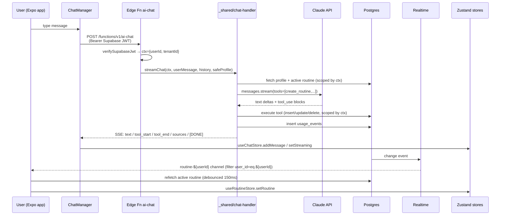
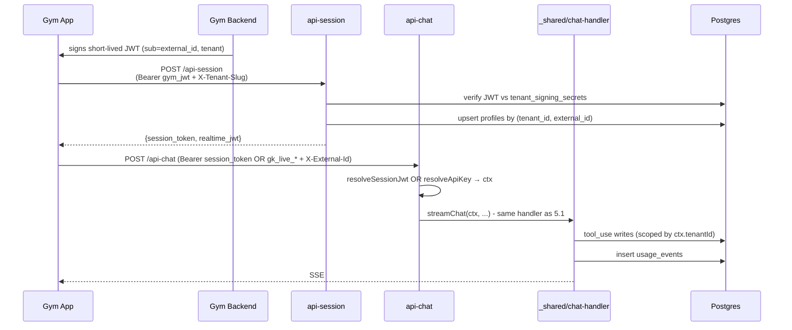
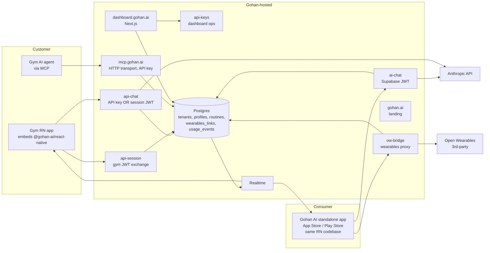
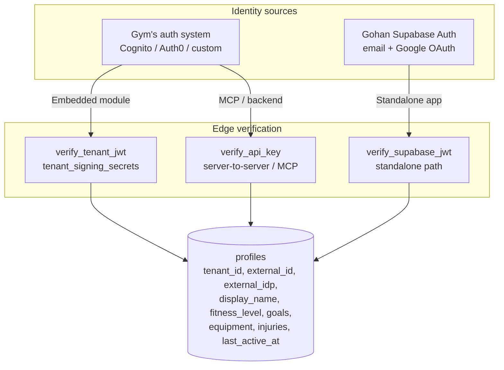

# Gohan AI — Architecture

System reference for the Gohan AI codebase. Covers current state, target state, data flows, security model, and key decisions.

> Companion docs in this folder: `tech-debt.md` (open items + resolutions), `auth-external-identity.md` (auth model spec), `architectural-changes/` (dated change records — like migrations for this doc), `presentation.md`, `open-wearables-setup.md`, `onboarding-skill.md`.
>
> When this doc and any other doc disagree, **this doc wins** for *current* state; `architectural-changes/` wins for *how it changed*. Code wins over both.

---

## 1. Overview

AI personal trainer that ships as **a module + MCP server**. Gym apps embed it; their members chat with an AI coach that builds and updates personalized routines in real time. Multi-tenant by design: one Supabase project hosts all gyms, distinguished by `tenant_id`.

**Two integration paths:**
1. **Drop-in React Native module** — `<GohanCoach />` component published as `@gohan-ai/react-native`. The gym's RN app embeds it; the gym's existing auth is the identity source.
2. **MCP server (HTTP)** — for gyms with their own AI/agent stack that want the routine tools without our UI.

**Two shipped apps, one codebase:**
- **Embedded module** (`@gohan-ai/react-native`) — chat + routine UI extracted from this repo, consumed by the gym's app, authenticated via the gym's identity (JWT handoff).
- **Standalone consumer app** (this Expo project) — same screens, same components, same edge functions; the only delta is an auth shell (`app/(auth)/`) that uses Gohan's own Supabase Auth. Shipped to the App Store / Play Store as "Gohan AI", tenant `default`.

Both surfaces hit the **same backend, same `profiles` table, same auth model** — they only differ in *how* identity is verified at the edge. See §10.

---

## 2. Tech Stack

| Layer | Tech | Version |
|-------|------|---------|
| Mobile | React Native + Expo (prebuild) | RN 0.83.6 / Expo 55 |
| Routing | Expo Router (file-based) | 5.x |
| Styling | NativeWind + Tailwind | NW 4 / TW 3 |
| State | Zustand | 5.x |
| Backend | Supabase (Postgres + Auth + Realtime + Storage + Edge Fns/Deno) | 2.105 client / 2.49 edge |
| AI | Anthropic SDK (`claude-sonnet-4-20250514`, streaming + tool_use) | 0.95 (client) / 0.39 (edge) |
| MCP | `@modelcontextprotocol/sdk` (HTTP transport with API-key auth + stdio fallback) | 1.0 |
| Landing | Next.js (separate `landing/`) | 15 |
| Dashboard | Next.js (`dashboard/`) | 15 |
| TS | strict mode, path alias `@/* → src/*` | 5.9 |

**Build**: Hermes bytecode via `eas build`. NativeWind through `metro.config.js`. No production minifier config beyond Expo defaults — covered in `productization-faq.md` §3.

---

## 3. Repository Layout

```
app/                         Expo Router screens (standalone shell only — excluded from npm bundle)
  _layout.tsx                Root guard + auth state propagation
  (auth)/login.tsx
  (tabs)/                    coach, routine, qr, mas, index
  +html.tsx                  Web HTML head shim
  routine/[day].tsx          Detail view (placeholder)

src/                         Shared code — physically present, transitively bundled
  components/                chat / routine / ui primitives + GohanCoach root
  hooks/                     useRealtimeRoutine, useAudioRecorder, useSpeechRecognition, useOpenWearables
  modules/                   chat (ChatManager), coach (CoachProvider/Context), json-render, routine
  services/                  supabase client, auth, profiles, tenant, routines, conversations,
                             api/ (CoachConfig + ApiClient), openWearables (now ow-bridge wrapper, §14)
  store/                     useAuthStore, useTenantStore, useRoutineStore, useChatStore, useCoachStyleStore
  theme/                     colors, tokens, useTheme, tenants/megatlon
  types/                     contracts (chat, routine, tenant, user, database, coach)

supabase/
  functions/_shared/         chat-handler.ts (tool schemas + executors + streaming loop),
                             coach-instructions.ts (system prompt parts), jwt.ts (HS256 verify)
  functions/ai-chat/         Standalone-app entry — verifies Supabase JWT
  functions/api-chat/        B2B entry — accepts gk_live_* API key OR Gohan session JWT
  functions/api-session/     Gym JWT → Gohan session token (+ realtime_jwt: TD-10)
  functions/api-keys/        Issue / list / revoke tenant API keys (dashboard-facing)
  functions/ow-bridge/       Open Wearables proxy — admin auth + identity mapping
  migrations/                001 → 009 (tenants/profiles, RLS, realtime, external identity,
                             API keys, profiles FK relax, sources, replica identity full,
                             child-table denormalization, wearables_links)
  seed_megatlon_tenant.sql, seed/load_sources.ts, seed/sources.json

mcp-server/                  Hosted MCP server (Node/TS) — HTTP transport with API-key auth + stdio fallback
packages/                    npm-publishable workspaces
  react-native-coach/        @gohan-ai/react-native (embeddable Coach module, tsup-built)
dashboard/                   Next.js B2B dashboard (gym-operator console)
landing/                     Next.js marketing site (gohan.ai) + /mcp docs page
docs/                        ARCHITECTURE, tech-debt, auth-external-identity, presentation,
                             open-wearables-setup, onboarding-skill, architectural-changes/
```

Module ownership (week-1 split, see `FOUNDATION.md`): @thblu (routine), @alexndr-n (chat/UI/nav), @DanteDia (services/supabase/types), @Juampiman (AI/MCP). The codebase has since converged across owners; cross-territory edits are normal.

---

### 3.1 Service Topology

The repo holds **eight independently deployed processes/artifacts** plus one third-party dependency. Each has its own runtime, build pipeline, and host. They are not co-deployed: any one of them can be redeployed without rebuilding the others.

| # | Process / Artifact | Runtime | Source | Build | Deploy target | Talks to (out) | Receives from (in) |
|---|---|---|---|---|---|---|---|
| 1 | **Mobile app (standalone)** | iOS / Android via Hermes; web via `react-native-web` | `app/`, `src/`, `assets/` | `eas build` (native) / `expo start --web` (web) | App Store, Play Store, Vercel (web preview) | edge functions (HTTPS, including `ow-bridge` for wearables), Realtime (WSS) | end users |
| 2 | **Embeddable npm module** | host app's RN runtime | `packages/react-native/`, transitively `src/components`, `src/modules`, `src/services/api`, `src/store`, `src/theme`, `src/hooks` (only what `<GohanCoach />` imports) | `tsup` ESM+CJS | `@gohan-ai/react-native` on npm | edge functions via injected `ApiClient` | gym apps embedding `<GohanCoach />` |
| 3 | **Edge functions** | Deno (Supabase) | `supabase/functions/` | `supabase functions deploy <name>` | Supabase platform `*.functions.supabase.co` | Postgres (admin), Anthropic API | mobile app, npm module hosts, MCP server (indirectly), dashboard |
| 4 | **Postgres + Realtime** | Supabase managed | `supabase/migrations/` | `supabase db push` | Supabase project `gohan-ai` (sa-east-1) | (none — system of record) | edge functions, MCP server, dashboard, Realtime subscribers |
| 5 | **MCP server** | Node.js (target: Docker) | `mcp-server/` (separate `package.json` + `tsconfig`) | `tsc` → `dist/` (today); `tsup` + Docker (target) | fly.io / Deno Deploy at `mcp.gohan.ai` (target) | Postgres (admin) | gym backends + LLM agents over HTTP/JSON-RPC, local dev tooling over stdio |
| 6 | **Dashboard** | Node.js / Next.js | `dashboard/` (separate `package.json` + `tsconfig`) | `next build` | Vercel at `dashboard.gohan.ai` | Postgres (RLS-scoped reads), edge functions (api-keys) | gym operators |
| 7 | **Landing site** | Node.js / Next.js | `landing/` | `next build` | Vercel at `gohan.ai` | (static + minimal API) | public visitors, MCP docs readers at `/mcp` |
| 8 | **Open Wearables backend** *(third-party, not in this repo)* | (their stack) | external | external | (their host) | Postgres (theirs) | edge function `ow-bridge` only — mobile app no longer talks to OW directly (§14) |

#### Topology diagram

```
                                                      ┌──────────────────────────────┐
                                                      │      End users (browsers,    │
                                                      │      iOS/Android devices)    │
                                                      └──────┬──────────────┬────────┘
                                                             │              │
                                                             ▼              ▼
                                                  ┌────────────────┐  ┌─────────────────┐
                                                  │  Mobile app    │  │ Landing (Vercel)│
                                                  │  (standalone)  │  │   gohan.ai      │
                                                  │  iOS / Android │  └─────────────────┘
                                                  │  / Web         │
                                                  └────┬───────────┘
                            ┌──────────────────────────┤
                            │            │             │            │
                            ▼            ▼             ▼            ▼
                  ┌────────────┐ ┌─────────────┐ ┌─────────┐ ┌──────────────┐
                  │ ai-chat    │ │ api-session │ │api-chat │ │ ow-bridge    │
                  │ (Deno edge)│ │ (Deno edge) │ │(Deno    │ │ (Deno edge)  │
                  │            │ │             │ │ edge)   │ │              │
                  └─────┬──────┘ └──────┬──────┘ └────┬────┘ └──────┬───────┘
                        │               │             │             │
                        │               │             │             ▼
                        │               │             │      ┌─────────────────┐
                        │               │             │      │ Open Wearables  │
                        │               │             │      │ backend (3rd-   │
                        │               │             │      │ party)          │
                        │               │             │      └─────────────────┘
                        ▼               ▼             ▼
                                ┌──────────────────┐
                                │   Postgres       │
                                │   + Realtime     │◀──── Mobile app subscribes (WSS)
                                │   (Supabase)     │
                                └──────────────────┘
                                  ▲             ▲
                                  │             │
              ┌───────────────────┘             └─────────────────┐
              │                                                   │
   ┌────────────────┐                                  ┌──────────────────────┐
   │  MCP server    │◀─── Gym backends + LLM agents    │ Dashboard (Vercel)   │
   │ mcp.gohan.ai   │     (HTTP/JSON-RPC + API key)    │ dashboard.gohan.ai   │◀── Gym operators
   │  (Node)        │                                  │   (Next.js)          │
   └────────────────┘                                  └──────────────────────┘

   ┌──────────────────────────────────────────────────────────────────────────┐
   │  Embeddable npm module (@gohan-ai/react-native)                          │
   │  Built from packages/react-native + transitive src/* (single entrypoint  │
   │  <GohanCoach />). Consumed by gym apps; talks to api-chat / api-session  │
   │  via injected ApiClient. NOT a running process — bundled into the host.  │
   └──────────────────────────────────────────────────────────────────────────┘
```

#### Code-vs-process boundary (clarification)

`src/` is shared between the standalone app and the embeddable module via **transitive import from the entrypoint**, not whole-directory shipping.

- The embeddable module has a single ESM entrypoint, `<GohanCoach />`. `tsup` walks the import graph from there. Anything not reachable is tree-shaken out.
- `openWearables.ts` is reachable only from `app/(tabs)/mas.tsx`. The `app/` tree is excluded from the module bundle (it's the standalone shell, not the embeddable surface).
- Therefore: `openWearables.ts` exists in `src/services/`, ships in the standalone app, does not ship in the npm module.

The earlier "fragility" call-out (admin creds could leak if a shared component pulled in `useOpenWearables`) is closed by §14 — `openWearables.ts` no longer carries credentials, so transitive bundling no longer has security consequences. The boundary is still implicit (no `package.json` `exports` field, no ESLint guard); a CI assertion is tracked as TD-20.

---

## 4. Data Model

```mermaid
erDiagram
    tenants ||--o{ profiles : "has"
    tenants ||--o{ tenant_api_keys : "issues"
    tenants ||--o{ tenant_signing_secrets : "uses"
    profiles ||--o{ routines : "owns"
    profiles ||--o{ wearables_links : "links"
    routines ||--o{ routine_days : "has"
    routine_days ||--o{ routine_exercises : "has"
    profiles ||--o{ conversations : "has (unused, TD-12)"
    conversations ||--o{ messages : "has (unused, TD-12)"
    profiles ||--o{ usage_events : "generates"

    tenants { uuid id PK; text slug UK; text name; text primary_color; text secondary_color; text logo_url }
    profiles { uuid id PK; uuid tenant_id FK; text display_name; text fitness_level; text[] equipment_available; text[] injuries; text[] goals; bool onboarding_completed; text external_id; text external_idp; timestamptz last_active_at }
    routines { uuid id PK; uuid user_id FK; uuid tenant_id FK; text name; bool is_active }
    routine_days { uuid id PK; uuid routine_id FK; uuid user_id "denorm 008"; uuid tenant_id "denorm 008"; smallint day_of_week; text[] muscle_groups; text label }
    routine_exercises { uuid id PK; uuid routine_day_id FK; uuid user_id "denorm 008"; uuid tenant_id "denorm 008"; text exercise_name; int sets; int reps; numeric weight_kg; int rest_seconds; text notes; text ai_reasoning; bool completed; int order_index }
    conversations { uuid id PK; uuid user_id FK }
    messages { uuid id PK; uuid conversation_id FK; text role; text content; text audio_url }
    wearables_links { uuid user_id PK,FK; uuid tenant_id FK; text provider; text external_id; timestamptz connected_at }
    usage_events { uuid id PK; uuid tenant_id; uuid user_id; text event_type; int tokens_in; int tokens_out; int tool_calls; int latency_ms; text model; timestamptz created_at }
    tenant_api_keys { uuid id PK; uuid tenant_id FK; text key_hash; text kid; timestamptz created_at; timestamptz revoked_at }
    tenant_signing_secrets { uuid id PK; uuid tenant_id FK; text kid; text secret; timestamptz created_at; timestamptz revoked_at }
    sources { text id PK; text title; text category; text url }
```

**Schema source**: migrations `001_initial_schema.sql` through `009_wearables_links.sql`. Realtime publication includes `routines`, `routine_days`, `routine_exercises` (publication set up in 003; `REPLICA IDENTITY FULL` set on all three in 007).

**Quirk**: `remove_exercise` does not reindex siblings — `order_index` may have gaps after delete. Always sort, never assume contiguous.

**Stale schema (tracked as TD-12)**: `conversations` and `messages` tables exist with RLS but no code reads or writes them. Chat history is in-memory only (`MOCK_CONVERSATION_ID` constant in `ChatManager.ts`).

---

## 5. Architecture Diagrams

### 5.1 Standalone-app data flow (Supabase JWT)



### 5.2 B2B-hosted data flow (gym JWT → Gohan session token → API key path)



> The handler (`_shared/chat-handler.ts`) is identical between 5.1 and 5.2. Only the entry shim differs in how it resolves `ctx`.

### 5.3 Infrastructure (current)



### 5.4 Multi-tenant resolution at request time (current)

```mermaid
flowchart TD
    Req[Incoming request] --> A{Auth header}
    A -->|gk_live_*| B[Hash key, lookup tenant_api_keys + X-External-Id]
    A -->|Gohan session JWT| C[Verify HS256, extract tenant_id from claims]
    A -->|Supabase JWT| D[supabaseAdmin.auth.getUser → profile.tenant_id]
    A -->|Gym JWT + X-Tenant-Slug| E[Lookup tenant_signing_secrets, verify JWT]
    B --> T[ctx = {userId, tenantId}]
    C --> T
    D --> T
    E --> T
    T --> Q[All DB queries scoped by ctx, never by request body]
```

---

## 6. Frontend Architecture

**Navigation tree** (`app/_layout.tsx`):
- `useProtectedRoute()` — redirects unauth → `(auth)/login`, redirects auth-in-auth-group → `/`
- `useAuthStateChange` — on session change, fetches profile via `getProfile()`, then tenant via `getTenantById()`, hydrates Zustand stores
- `useDemoAutoLogin()` — web `?demo=1` shortcut

**Tabs layout** (`app/(tabs)/_layout.tsx`, ~141 lines):
- Hardcoded build-time Megatlon shell (5 tabs: `index`, `coach`, `qr`, `routine`, `mas`) — black navbar, orange brand, custom `MegatlonTabBar`.
- **No runtime branch on `tenant.slug`** — tenant identity is locked at build time per the policy in `docs/architectural-changes/2026-05-10-build-time-tenant-policy.md`. Future second-tenant binaries will read `EXPO_PUBLIC_TENANT_SLUG` at compile time and select a different shell.

**Zustand stores**:

| Store | Shape | Written by |
|-------|-------|------------|
| `useAuthStore` | `{ user: UserProfile \| null; isAuthenticated; isLoading }` | `_layout.tsx:62` after `getProfile` |
| `useTenantStore` | `{ tenant: Tenant \| null; isLoaded }` | `_layout.tsx:69` after `getTenantById` |
| `useRoutineStore` | `{ routine: Routine \| null; selectedDay; isLoading }` | `useRealtimeRoutine.ts` after debounced refetch |
| `useChatStore` | `{ messages[]; streaming; activeTool; isLoading }` | `ChatManager.ts` on SSE events |

**Theming**: `useTheme()` (`src/theme/useTheme.ts`) reads `useTenantStore` at runtime for any dynamic-color values, falls back to indigo `colors.brand[500]`. Static tenant tokens at `src/theme/tenants/megatlon.ts`. **No pre-login branding today** — RLS blocks anon reads of `tenants`. Tracked in §11 risk table.

---

## 7. Backend Architecture

### 7.1 Chat pipeline (`supabase/functions/_shared/chat-handler.ts`)

`ai-chat` and `api-chat` are thin entry shims (~125–165 lines each) that resolve `(userId, tenantId)` from a verified token and delegate to a single shared module. **All chat behaviour lives in `_shared/chat-handler.ts`.** Identity is never read from the request body — see §11.

| Concern | Location | Notes |
|---------|----------|-------|
| Tool definitions | `_shared/chat-handler.ts:36–230` | `create_routine`, `update_exercise`, `replace_exercise`, `add_exercise`, `remove_exercise`, `switch_routine`, `delete_routine`, `update_routine_day`, `cite_sources`, `update_user_profile` |
| Tool handlers | `_shared/chat-handler.ts:~250–500` | Postgres writes via service role; every handler scopes by `(user_id, tenant_id)` from the verified `ctx`, never from input |
| Onboarding flag | `_shared/chat-handler.ts:306–311` | `executeCreateRoutine` flips `profiles.onboarding_completed = true` server-side. Client mirrors the flag locally for next-turn UX (`ChatManager.ts`) but no longer writes it. |
| System prompt assembly | `_shared/coach-instructions.ts` | scope guardrail (fitness only), onboarding-mode toggle, coach-style personality, citation rules |
| Streaming loop | `_shared/chat-handler.ts` | up to N tool iterations; emits SSE event types listed below |
| Non-streaming fallback | `_shared/chat-handler.ts` | header `x-no-stream: true` returns full JSON |

> Line numbers above are indicative — the file is ~960 lines today. Treat them as anchors, not invariants. Splitting this file is tracked as TD-11 in `docs/tech-debt.md`.

**SSE event contract** (CLAUDE.md:73–77):
```
data: {"type":"text","content":"<delta>"}
data: {"type":"tool_start","toolName":"create_routine"}
data: {"type":"tool_end","toolName":"create_routine","toolSuccess":true}
data: {"type":"error","content":"<msg>"}
data: [DONE]
```

### 7.2 Auth trigger (`002_rls_and_storage.sql` + `004_external_identity_and_api_keys.sql`)

`handle_new_user()` is a `SECURITY DEFINER` trigger on `auth.users INSERT`. It reads `raw_user_meta_data.tenant_slug` + `display_name`, falls back to `default` tenant, and inserts a `profiles` row with `external_idp = 'gohan'`, `external_id = NEW.id::text`. This is how the standalone-consumer signup path attaches a tenant. The same upsert-by-`(tenant_id, external_id)` pattern is used at runtime by `api-session` for embedded gym users (§10.1 mode 1).

### 7.3 MCP server (`mcp-server/src/index.ts`)

10 tools today: `get_user_routine`, `list_exercises_for_day`, `update_exercise`, `add_exercise`, `remove_exercise`, `replace_exercise`, `get_user_profile`, `get_tenant_info`, `list_tenant_users`, plus the AI counterparts. Uses the **service role key** internally, but every tool entry is wrapped by `scopeTenant()` (`mcp-server/src/index.ts:86–93`) which derives `tenantId` from the API key (`:509+`) and asserts ownership inside `resolveUserId()` before any read or mutation. There is no path that hits Postgres without a verified `(api_key → tenant_id)` resolution.

---

## 8. Realtime Architecture

- **Channel**: `routine-${userId}` (`useRealtimeRoutine.ts`)
- **Tables**: `routines`, `routine_days`, `routine_exercises` (all set to `REPLICA IDENTITY FULL` in migration 007 so UPDATE events ship the full pre-image)
- **Pattern**: any change → debounced 150ms → `getActiveRoutine(userId)` + `listUserRoutines(userId)` → `useRoutineStore.setRoutine` / `setRoutines`
- **Wire-side filters** (post-migration 008):
  - `routines`: filtered by `user_id=eq.${userId}` ✅
  - `routine_days`: filtered by `user_id=eq.${userId}` ✅ (column denormalized in migration 008; see `docs/architectural-changes/2026-05-10-denormalize-child-tables.md`)
  - `routine_exercises`: filtered by `user_id=eq.${userId}` ✅ (same)
- **Embedded-path realtime auth**: `useRealtimeRoutine.ts` calls `supabase.realtime.setAuth(token)` for the embedded module path, but `api-session`'s `realtime_jwt` minting is not wired. **Today, the embedded module receives no realtime events** (the standalone path works because it already has a Supabase JWT). Tracked as TD-10.

---

## 9. Authentication & Authorization (current state)

| Vector | Today |
|--------|-------|
| End-user auth — standalone | Supabase Auth: email/password + Google OAuth (PKCE on native via `expo-web-browser`) |
| End-user auth — embedded | Gym's identity system; gym backend signs JWT with shared secret, exchanged via `api-session` for a Gohan session token |
| Session storage (standalone) | AsyncStorage on native, localStorage on web (`src/services/supabase.ts`) |
| Tenant attachment (standalone signup) | `raw_user_meta_data.tenant_slug` at signup → `handle_new_user` trigger writes `profiles.tenant_id` |
| Tenant attachment (embedded) | `api-session` upserts profile by `(tenant_id, external_id)` from verified gym JWT |
| RLS — `tenants` | SELECT open to authenticated; **anon blocked** (pre-login branding still open) |
| RLS — `profiles` / `routines` / `routine_days` / `routine_exercises` | scoped by `auth.uid()` (`002_rls_and_storage.sql`); RLS still applies to direct client reads |
| Edge function model | Service role internally, but every entry derives `ctx = {userId, tenantId}` from a **verified token** (Supabase JWT, Gohan session JWT, or API key) before any DB op. Body `userProfile.id` is stripped at the entry. |
| MCP server | Service role internally; every tool wrapped in `scopeTenant()` (§7.3); API key resolves `tenant_id` at request entry |
| Storage `chat-audio` | Bucket private, path-prefix RLS by `auth.uid()` |
| Anthropic API key | Edge function secret only — never in client code |
| OW admin credentials | Edge function secret on `ow-bridge` only — never in client code (§14) |

§10 covers the auth model itself — modes of token verification, identity resolution, and how the same `profiles` row is shared across surfaces.

---

## 10. Authentication & Authorization (model — see `docs/auth-external-identity.md` for the full spec)

**One auth system, two identity sources.** Every request — whether from the embedded module inside a gym app or from the standalone consumer app — resolves to the same `profiles` row keyed by `(tenant_id, external_id)`. The edge functions don't branch on "is this embedded vs standalone"; they only branch on *how the incoming token is verified*. Once verified, the downstream code path is identical.



### 10.1 Verification modes

1. **Backend-to-backend JWT** (default for embedded module). Gym signs JWT with shared secret; Gohan verifies via `tenant_signing_secrets`. Upserts `profiles` by `(tenant_id, external_id)`. Returns short-lived Gohan session token.
2. **Supabase JWT** (standalone consumer app). User signs in via Gohan's Supabase Auth (email/password + Google OAuth, already wired in `app/(auth)/login.tsx`). Edge function verifies the JWT against the Supabase JWKS, derives `user_id` from `sub`. Tenant is hardcoded `default`. The `profiles` row is created by the existing `handle_new_user` trigger (`002_rls_and_storage.sql:36–66`) with `external_idp = 'gohan'`, `external_id = auth.users.id`.
3. **API key + external_id** (server-to-server / MCP). Gym sends `{api_key, external_id}`; tenant scope is implicit in the key.
4. **OIDC/SAML** (enterprise). Same upsert flow; `iss` resolves tenant, `sub` is `external_id`. Deferred until first ask.

### 10.2 Storing rich user state on Gohan's side

The whole point of having a `profiles` row per user — even when the gym owns the credentials — is so that Gohan can hold the *fitness identity*: goals, equipment, injuries, training history, routine state, conversation context. The gym keeps the credential identity (email, password, MFA); we keep everything we need to coach.

Practical rules for the embedded module:
- The gym JWT is treated as **opportunistic profile sync**: every `/api/session` call accepts `{name, email?, locale?, age?, gender?, ...}` claims and updates `profiles` columns we care about. No background sync job needed — the JWT is fresh on each session.
- Anything the user tells the AI coach (fitness level, goals, injuries, equipment) is persisted to `profiles` via the `update_user_profile` tool path. This data is **owned by Gohan**, not the gym — it survives even if the gym churns the user out, and can be exported back to them via the `GET /api/users/{external_id}` endpoint.
- Conversation history, routines, and usage events live entirely in our Postgres. The gym's app sees them only through our API; they cannot diverge.

### 10.3 Standalone consumer app — same auth, no code fork

The standalone app reuses the entire `src/components/`, `src/modules/`, `src/hooks/`, `src/store/` tree. The **only** delta is the auth shell (`app/(auth)/login.tsx`, `useAuthStateChange`, `useProtectedRoute`) which uses Supabase Auth directly. Once a session exists, every downstream call (`/api/chat`, Realtime) uses a Supabase-issued JWT instead of a Gohan session JWT, but they hit the same edge functions and resolve to the same `profiles` schema.

Concretely: the standalone app is just "the embedded module + an auth screen + tenant pinned to `default`." When packaging the npm module (`@gohan-ai/react-native`), the auth shell is excluded; everything under `src/` is shared verbatim. See §14 for build configuration.

### 10.4 Realtime auth path

**Standalone users:** The Supabase JWT they already have is used directly — no extra step. `useRealtimeRoutine` subscribes against the user's authenticated session.

**Embedded users (gym JWT origin):** The plan is for `api-session` to mint a Supabase JWT scoped to the user's row from service role + RLS, returned alongside the Gohan session token. The client side already calls `supabase.realtime.setAuth(token)`; **the server side is not wired yet.** Until it lands, embedded clients receive no realtime events. Tracked as TD-10.

### 10.5 API keys

SHA-256 hashed, scoped per tenant, support `kid` for rotation, plaintext shown once.

---

## 11. Security Concerns

| Risk | Mitigation | Status |
|------|------------|--------|
| Edge function trusts body `userProfile.id` | Identity derived from verified JWT; body `id` stripped | **CLOSED** — `ai-chat/index.ts:74` strips body `id`; `userId`/`tenantId` come from `verifySupabaseJwt()` (`:47–61`). `api-chat/index.ts:113` same pattern. `_shared/chat-handler.ts` only ever reads `ctx`. |
| MCP server unscoped service role | API key resolves tenant; every tool wrapped in `scopeTenant()` | **CLOSED** — `mcp-server/src/index.ts:86–93`, `:187`, `:408`, `:428–434`, `:468`, `:509+`. |
| `onboardingCompleted` not auto-set after `create_routine` | Flip flag in tool handler | **CLOSED** — `_shared/chat-handler.ts:306–311`. The redundant client-side write was removed (and `markOnboardingCompleted` deleted from `src/services/profiles.ts`); local store still mirrors the flag for next-turn UX. |
| Realtime cross-tenant leak | Filter subscriptions wire-side by `user_id` on every routine table | **CLOSED** — migration `008_denormalize_user_tenant_to_children.sql` adds `user_id` (and `tenant_id`) NOT NULL to `routine_days` and `routine_exercises`, mirroring ADR #7. All three subscriptions now filter by `user_id=eq.${userId}` (`useRealtimeRoutine.ts`). Insert sites updated in `_shared/chat-handler.ts` (`executeCreateRoutine`, `executeAddExercise`) and `mcp-server/src/index.ts` (`add_exercise`, `replace_exercise`). |
| Open Wearables admin creds in client bundle | Move auth to `ow-bridge` edge function; persist `(gohan_user_id ↔ ow_user_id)` in `wearables_links` | **CLOSED** — `supabase/functions/ow-bridge/index.ts` is the only path that holds OW admin creds (env vars `OW_HOST`, `OW_ADMIN_USERNAME`, `OW_ADMIN_PASSWORD`, `OW_API_KEY`). Mapping persists in `wearables_links` (migration 009). Client (`src/services/openWearables.ts`) is now a thin Supabase-JWT-authenticated wrapper. **Deploy steps:** `supabase functions deploy ow-bridge`; set the four env secrets; rotate the OW admin password (the historical literal is still flagged by `gitleaks`). |
| Secrets in git history | Rotate + `git filter-repo` + `gitleaks` hook | **PARTIAL** — `.gitleaks.toml` is wired into CI (prevents *new* leaks). The historical OW admin literal still lives in git history; rotation is TD-2; history scrub is optional. |
| `usage_events` table is unwritten | Insert one row per stream completion in `_shared/chat-handler.ts` | **CLOSED** — `recordUsage()` (`_shared/chat-handler.ts:709–724`) is called from all three completion paths: streaming success (`:859`), non-streaming success (`:908`), max-iterations bailout (`:943`). Captures tokens, tool_calls, latency, model. Failures are swallowed (`try/catch` at `:721`) so telemetry never breaks the request. |
| Service role in `supabaseAdmin` codepaths | Always derive `tenant_id` / `user_id` from verified token, never from body | Pattern enforced — every `ctx` is built before calling into chat-handler. |
| Prompt injection via profile fields | Claude is robust; monitor in `usage_events` | Accepted (gated on `usage_events` write path landing). |
| No rate limiting | Per-tenant + per-user limits at public API edge | OPEN — no tracker |
| PII / data residency | Only `sa-east-1` today; multi-region for EU | DEFERRED — gated on first EU customer |
| Pre-login branding | RLS blocks anon read of `tenants` | OPEN — under build-time tenant policy (ADR #12) this matters less, since the consumer app knows its tenant at compile time |
| Hermes bundle reverse-eng | Acceptable; real IP lives in edge function | Accepted |
| Embeddable npm module: import-graph guard against `openWearables.ts` | `ow-bridge` removes the secret from the bundle entirely | **CLOSED** by ow-bridge: `src/services/openWearables.ts` no longer holds credentials, so it is safe to ship anywhere. Belt-and-braces: `gitleaks` rule in `.gitleaks.toml` flags any re-introduction of the historical literal. |

---

## 12. Architectural Decisions (ADRs)

| # | Decision | Rationale |
|---|----------|-----------|
| 1 | Edge function over client-side AI inference | Protects ANTHROPIC_API_KEY + system prompt IP; lets us upgrade models centrally |
| 2 | Shared schema + `tenant_id` discriminator (vs schema-per-tenant) | One migration, one Postgres, simpler RLS |
| 3 | External identity over Gohan-owned auth (embedded) | Gym remains source of truth; no password sync; clean GDPR |
| 4 | Hosted MCP HTTP over distributed stdio | Zero install on gym side; auth at our edge; one URL per customer |
| 5 | API key + signed JWT handoff (vs OAuth) | Faster integration; matches Stripe/Intercom playbook |
| 6 | Single Supabase project for all tenants | Cost; operational simplicity. Re-evaluate when largest tenant > 30% MAU |
| 7 | `tenant_id` denormalized onto `routines` | Avoid join through `profiles` for hot queries; simpler RLS |
| 8 | Defer chat persistence (in-memory only for v1) | `conversations` / `messages` schema exists with RLS, but the client uses `MOCK_CONVERSATION_ID`. Re-evaluate when a "remember last week's chat" product feature is on the roadmap (TD-12). |
| 9 | Ship a React Native embeddable module **and** a standalone Expo app from one codebase (instead of a hosted webview for non-RN gyms) | Webview path required a separate web build, separate hosting, separate auth/CORS surface, and degraded UX (no native gestures, no haptics, no native voice). RN module + standalone app reuses ~90% of code under `src/`, only the auth shell differs. Non-RN gyms route through MCP instead of webview |
| 10 | Single auth model (`profiles` keyed by `tenant_id, external_id`) for both embedded and standalone, differing only at the verification step | Lets us share every store/service/hook between the two surfaces. Standalone is just "tenant=default, external_idp=gohan, external_id=supabase_user.id" — no auth fork |
| 11 | Apply ADR #7's denormalization consistently to `routine_days` + `routine_exercises` (migration 008) | Without it, Realtime cannot wire-filter `routine_exercises` events by user — RLS gates the payload but events still fan out. Mirroring ADR #7 to the child tables makes wire-side scoping uniform across the routine subtree. See `docs/architectural-changes/2026-05-10-denormalize-child-tables.md`. |
| 12 | Build-time tenant identity (one binary per tenant) | A single binary serving multiple tenants would need runtime branching on `tenant.slug` for shells, themes, and copy — fragile and hard to audit. Instead, each tenant has its own EAS profile reading `EXPO_PUBLIC_TENANT_SLUG` at build. Embedded gym integrations are unaffected (they consume the npm module, not a binary). See `docs/architectural-changes/2026-05-10-build-time-tenant-policy.md`. |
| 13 | Open Wearables proxied through `ow-bridge` edge function (vs. direct client calls with bundled admin creds) | Closed three §10/§11 invariant violations: bundled admin creds, client-controlled identity, ephemeral state. The proxy adds one round trip per call, mitigated by a 5-min admin-token cache. Same pattern will extend to Whoop/Oura when added. See `docs/architectural-changes/2026-05-10-ow-bridge-landed.md`. |

---

## 13. Known Dead Code & Stale Schema

- **`src/modules/ai/`** (CoachEngine.ts, prompts.ts, tools.ts, types.ts): **deleted**. Historical reference at `src/services/api/chat.ts:1–3`. Server-side inference is the only path.
- **`conversations` / `messages` tables**: created in migration 001 with full RLS in 002, but **no code reads or writes them**. `ChatManager.ts:15` uses a `MOCK_CONVERSATION_ID` constant; chat history is in-memory and dies on app restart. ADR #8 frames this as deferred — tracked as TD-12.
- **`tenant_signing_secrets.kid` rotation**: schema supports rotation (`UNIQUE (tenant_id, kid)`), but `api-session` does not implement `kid` selection or grace-period overlap. Rotation is a manual two-row swap today — tracked as TD-14.

---

## 14. Wearables Bridge (Open Wearables) — current state

The "Conectar Reloj" sheet in the standalone shell's Más tab integrates with a third-party Open Wearables backend for steps / calories / sleep / workouts data. As of 2026-05-10 this integration **conforms to the §10 identity model**.

### Architecture

```
React Native client (mas.tsx)
   └─> src/hooks/useOpenWearables.ts
         └─> src/services/openWearables.ts          ── Supabase-JWT only, no admin creds
               └─> POST {SUPABASE_URL}/functions/v1/ow-bridge {action, ...}

Edge function ow-bridge (supabase/functions/ow-bridge/index.ts)
   ├─ verifySupabaseJwt(req) → {userId, tenantId, email, displayName}
   ├─ wearables_links: lookup external_id by user_id
   ├─ getAdminToken() (cached 5 min, creds from edge env)
   └─ dispatch on body.action:
       ├─ connect  → upsert wearables_links + find-or-create OW user
       ├─ sync     → POST OW_HOST/api/v1/sdk/users/{ext}/sync
       ├─ activity → GET  OW_HOST/api/v1/users/{ext}/summaries/activity
       ├─ sleep    → GET  OW_HOST/api/v1/users/{ext}/summaries/sleep
       └─ workouts → GET  OW_HOST/api/v1/users/{ext}/events/workouts
```

Schema (`migrations/009_wearables_links.sql`):

```sql
create table public.wearables_links (
  user_id      uuid primary key references public.profiles(id) on delete cascade,
  tenant_id    uuid not null references public.tenants(id),
  provider     text not null check (provider in ('open_wearables')),
  external_id  text not null,
  connected_at timestamptz not null default now(),
  unique (tenant_id, provider, external_id)
);
```

Edge-function secrets (set with `supabase secrets set`):

| Secret | Purpose |
|---|---|
| `OW_HOST` | Open Wearables API origin |
| `OW_ADMIN_USERNAME` / `OW_ADMIN_PASSWORD` | admin login for find-or-create user |
| `OW_API_KEY` | the SDK key used for the `/sync` endpoint |

### What this closes

| Old problem (pre-refactor) | Resolution |
|---|---|
| Admin creds in Hermes bundle | Moved to edge-function env; client never sees them |
| Client picks `email` to impersonate any OW user | OW external_id is resolved server-side from the verified Supabase JWT and persisted in `wearables_links` |
| Module-level `owUserId` resets on cold start | Mapping is durable in Postgres, fetched per request (cheap, indexed by `user_id` PK) |
| `openWearables.ts` not safe to ship in npm module | It now is — no secret material, no direct `OW_HOST` calls. The `gitleaks` rule in `.gitleaks.toml` guards against re-introduction. |

### Adding a second provider (Whoop, Oura, ...)

Extend the `provider` check constraint on `wearables_links`, add cases in `ow-bridge` action dispatch, add credentials to the edge-function env. Do **not** revert to client-side admin tokens for the new provider.

---

## 15. Build & Deploy

| Component | Build | Deploy |
|-----------|-------|--------|
| Mobile app (standalone) | `eas build` (Hermes bytecode, minified) | App Store / Play Store via EAS Submit |
| Edge functions | `supabase functions deploy <name> --no-verify-jwt` (Deno) — applies to `ai-chat`, `api-chat`, `api-session`, `api-keys`, `ow-bridge` | Supabase platform `*.functions.supabase.co` |
| MCP server | `tsc` → `dist/` | Currently runs locally / in dev; production target is fly.io / Deno Deploy at `mcp.gohan.ai` (`tsup` + Docker bundle still pending) |
| Embeddable RN module | `tsup` ESM + CJS, single entry `<GohanCoach />` reaching transitively into `src/`. Externalises `react`, `react-native`, `nativewind`, `expo-*`, `@supabase/supabase-js`. | `@gohan-ai/react-native` on npm |
| Standalone consumer app | `eas build` with `EXPO_PUBLIC_TENANT_SLUG=default`. Tenant identity is locked at build time (ADR #12). | App Store / Play Store as "Gohan AI" |
| Dashboard | `next build` | Vercel at `dashboard.gohan.ai` |
| Landing | `next build` | Vercel at `gohan.ai` |
| CI | `.github/workflows/ci.yml` runs `tsc --noEmit` matrix across root + each workspace, plus `gitleaks` | GitHub Actions |

When a second tenant ships, add a new EAS profile (`eas build --profile megatlon` etc.) reading `EXPO_PUBLIC_TENANT_SLUG=<slug>` at build time.

**Code-sharing boundary** between the npm module and the standalone app:

| Path | In `@gohan-ai/react-native` | In standalone app |
|------|-----------------------------|-------------------|
| `src/components/`, `src/modules/chat`, `src/modules/routine`, `src/hooks/`, `src/store/`, `src/theme/`, `src/types/` | ✅ exported | ✅ used |
| `src/services/` (HTTP client to public API + Realtime) | ✅ exported, accepts `{apiBaseUrl, getAuthToken}` injection | ✅ uses Supabase JWT as the token source |
| `app/(auth)/`, `app/_layout.tsx` auth guard | ❌ excluded | ✅ included |
| `app/(tabs)/` shells | ❌ excluded (host app provides nav) | ✅ included |

The module exposes a single `<GohanCoach />` root that wires the stores, the HTTP client, and the realtime subscription with whatever auth-token getter the host passes in. The standalone app passes a getter backed by `supabase.auth.getSession()`; the gym passes one backed by their session-token cache. Same code, different auth source.

### 15.1 Deploy order — migrations always before code

Schema changes in this repo land **with** the code that uses them, in the same PR. That keeps changes reviewable as one unit, but the deploy must be ordered: **apply migrations to the live DB before deploying the code that depends on them.** Otherwise the code path errors on first call (NOT NULL violations from new columns, missing tables, etc.).

Concrete order for any PR that touches `supabase/migrations/`:

1. `supabase db push` (or apply via dashboard SQL editor) — verify the migration applied cleanly, including any backfill.
2. `supabase functions deploy <changed-fn> --project-ref <ref> --no-verify-jwt` (per `supabase/README.md`) for any edge function that touches new columns/tables.
3. `eas build` (or relevant client deploy) only after the above succeed.

This is the "expand-contract" convention applied at the deploy level: the schema is **expanded** to be compatible with both old and new code (where possible — additive columns, idempotent backfill, NOT NULL only after successful backfill), so the window between "migration applied" and "new code live" is safe even if a deploy is interrupted. Migration files in this repo are written to be re-runnable (`IF NOT EXISTS`, conditional `DO $$ ... $$` blocks), so re-applying them is safe.

---

## 16. Pending design work

This document describes the **current** architecture. Design-level items that are known but not yet shipped — and tradeoff decisions that are still open — live in `docs/tech-debt.md` (TD-10 through TD-20). When a TD item is closed, its resolution is summarised here in the section it touched (e.g. the Realtime row of §11 references TD-10 if there's still embedded-path work pending).

Architectural changes to this document are recorded as dated entries in `docs/architectural-changes/` per the rule in `CLAUDE.md`.

---

## 17. Glossary

- **tenant** — a gym customer; row in `tenants` table, identified by `slug`
- **external_id** — gym's user ID (opaque to Gohan); unique per `(tenant_id, external_id)`
- **gohan_user_id** — internal `profiles.id` (UUID)
- **api key** (`gk_live_<slug>_<random>`) — server-to-server auth, scoped per tenant
- **signing secret** — per-tenant secret used to verify gym-issued JWTs
- **kid** — key ID for rotating signing secrets without downtime
- **tool_use** — Claude API capability where the model calls our defined functions; SSE event types `tool_start` / `tool_end`
- **session token** — short-lived Gohan-issued JWT after gym JWT exchange
- **realtime_jwt** — Supabase-scoped JWT minted alongside session token for Realtime subscriptions
