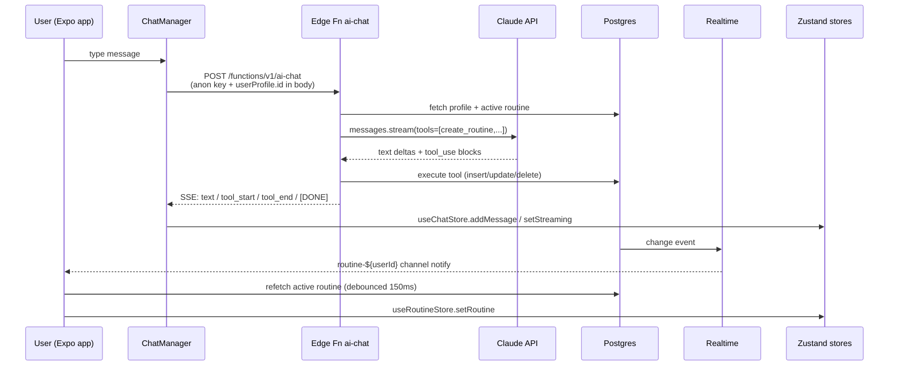
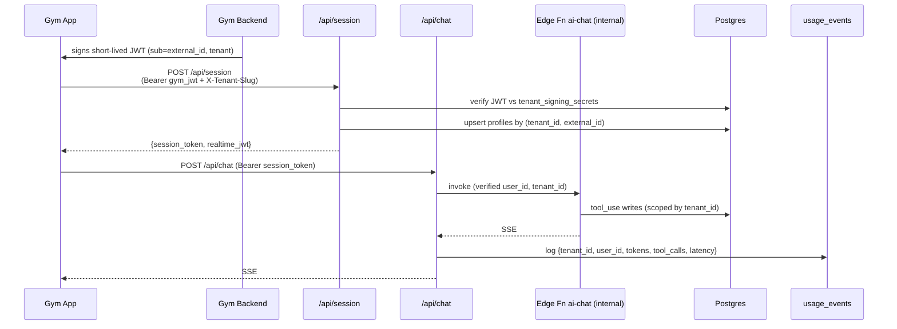
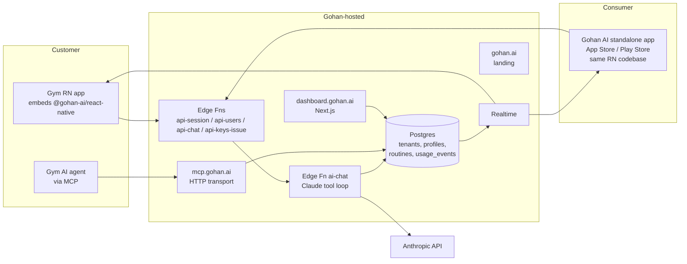
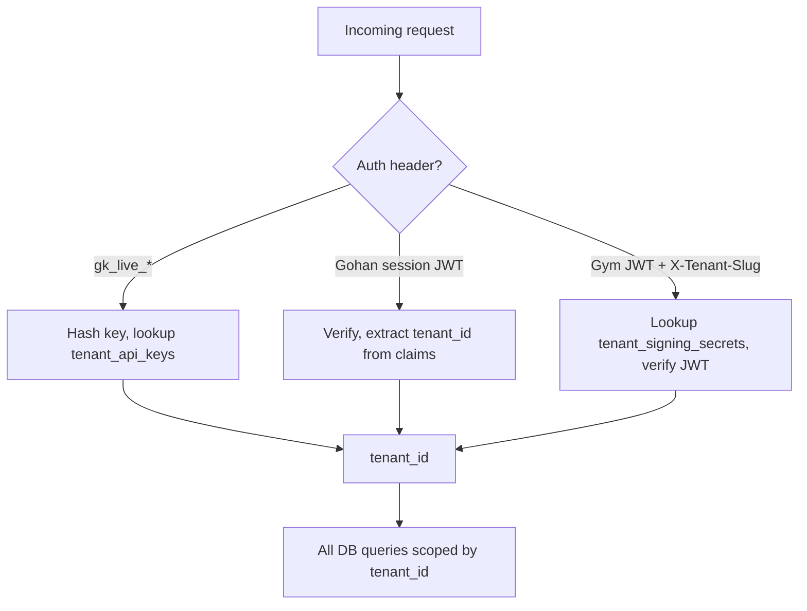
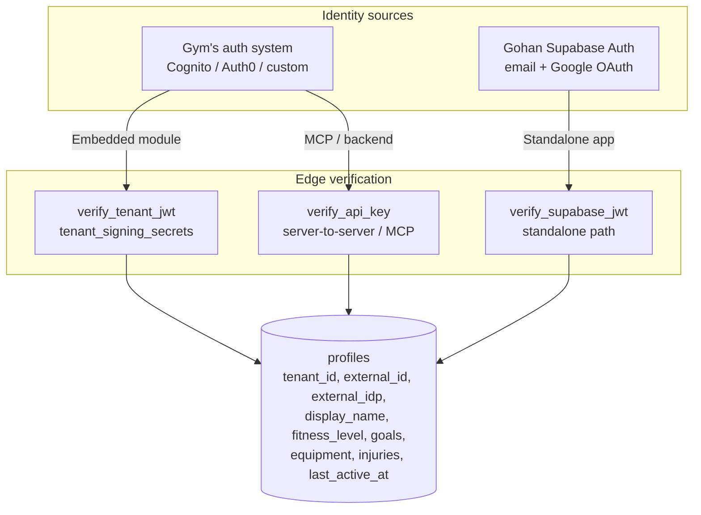

# Gohan AI — Architecture

System reference for the Gohan AI codebase. Covers current state, target state, data flows, security model, and key decisions.

> Companion docs in this folder: `PLAN.md` (implementation roadmap), `hosted-integration-model.md`, `auth-external-identity.md`, `productization-faq.md`.

---

## 1. Overview

AI personal trainer that ships as **a module + MCP server**. Gym apps embed it; their members chat with an AI coach that builds and updates personalized routines in real time. Multi-tenant by design: one Supabase project hosts all gyms, distinguished by `tenant_id`.

**Two integration paths:**
1. **Drop-in React Native module** — `<GohanCoach />` component published as `@gohan-ai/react-native`. The gym's RN app embeds it; the gym's existing auth is the identity source.
2. **MCP server (HTTP)** — for gyms with their own AI/agent stack that want the routine tools without our UI.

**Two shipped apps, one codebase:**
- **Embedded module** (`@gohan-ai/react-native`) — chat + routine UI extracted from this repo, consumed by the gym's app, authenticated via the gym's identity (JWT handoff).
- **Standalone consumer app** (this Expo project) — same screens, same components, same edge functions; the only delta is an auth shell (`app/(auth)/`) that uses Gohan's own Supabase Auth. Shipped to the App Store / Play Store as "Gohan AI", tenant `default`.

Both surfaces hit the **same backend, same `profiles` table, same auth model** — they only differ in *how* identity is verified at the edge. See §10.

---

## 2. Tech Stack

| Layer | Tech | Version |
|-------|------|---------|
| Mobile | React Native + Expo (prebuild) | RN 0.81.5 / Expo 54 |
| Routing | Expo Router (file-based) | 6.x |
| Styling | NativeWind + Tailwind | NW 4 / TW 3 |
| State | Zustand | 5.x |
| Backend | Supabase (Postgres + Auth + Realtime + Storage + Edge Fns/Deno) | 2.105 client |
| AI | Anthropic SDK (`claude-sonnet-4-20250514`, streaming + tool_use) | 0.95 (client) / 0.39 (edge) |
| MCP | `@modelcontextprotocol/sdk` (stdio today → HTTP target) | 1.0 |
| Landing | Next.js (separate `landing/`) | — |
| TS | strict mode, path alias `@/* → src/*` | 5.9 |

**Build**: Hermes bytecode via `eas build`. NativeWind through `metro.config.js`. No production minifier config beyond Expo defaults — covered in `productization-faq.md` §3.

---

## 3. Repository Layout

```
app/                         Expo Router screens (auth-gated)
  _layout.tsx                Root guard + auth state propagation
  (auth)/login.tsx
  (tabs)/                    coach, routine, qr, mas, index
  routine/[day].tsx          Detail view (placeholder)

src/
  components/                chat / routine / ui primitives
  hooks/                     useRealtimeRoutine, useAudioRecorder, useSpeechRecognition
  modules/                   chat (ChatManager) / ai (DEAD — see §13) / routine
  services/                  supabase client, auth, profiles, tenant, routines, conversations
  store/                     useAuthStore, useTenantStore, useRoutineStore, useChatStore
  theme/                     colors, tokens, useTheme, tenants/megatlon
  types/                     contracts (chat, routine, tenant, user, database)

supabase/
  functions/ai-chat/         Edge function (Deno) — Claude tool loop + DB writes
  migrations/                001 schema → 003 realtime
  seed_megatlon_tenant.sql

mcp-server/                  Stdio MCP server (TS, separate package)
landing/                     Next.js marketing site
documentation/               this folder
```

Module ownership (per `CLAUDE.md:27–32`): @thblu (routine), @alexndr-n (chat/UI/nav), @DanteDia (services/supabase/types), @Juampiman (AI/MCP).

---

## 4. Data Model

```mermaid
erDiagram
    tenants ||--o{ profiles : "has"
    tenants ||--o{ tenant_api_keys : "issues (target)"
    tenants ||--o{ tenant_signing_secrets : "uses (target)"
    profiles ||--o{ routines : "owns"
    routines ||--o{ routine_days : "has"
    routine_days ||--o{ routine_exercises : "has"
    profiles ||--o{ conversations : "has"
    conversations ||--o{ messages : "has"
    profiles ||--o{ usage_events : "generates (target)"

    tenants { uuid id PK; text slug UK; text name; text primary_color; text secondary_color; text logo_url }
    profiles { uuid id PK,FK; uuid tenant_id FK; text display_name; text fitness_level; text[] equipment_available; text[] injuries; text[] goals; bool onboarding_completed; text external_id "target"; text external_idp "target"; timestamptz last_active_at "target" }
    routines { uuid id PK; uuid user_id FK; uuid tenant_id "target"; text name; bool is_active }
    routine_days { uuid id PK; uuid routine_id FK; smallint day_of_week; text[] muscle_groups; text label }
    routine_exercises { uuid id PK; uuid routine_day_id FK; text exercise_name; int sets; int reps; numeric weight_kg; int rest_seconds; text notes; text ai_reasoning; bool completed; int order_index }
    conversations { uuid id PK; uuid user_id FK }
    messages { uuid id PK; uuid conversation_id FK; text role; text content; text audio_url }
```

**Schema source**: `supabase/migrations/001_initial_schema.sql`. Realtime publication includes `routines`, `routine_days`, `routine_exercises` (added across migrations 001 and 003).

**Quirk** (CLAUDE.md:82): `remove_exercise` does not reindex siblings — `order_index` may have gaps. Always sort, never assume contiguous.

**Currently unused at runtime**: `conversations` and `messages` tables exist but chat history is in-memory only (`MOCK_CONVERSATION_ID` constant in `ChatManager.ts`). Out of scope for the current refactor.

---

## 5. Architecture Diagrams

### 5.1 Current data flow (single-tenant, anon-key auth)



### 5.2 Target data flow (B2B hosted, JWT + API key)



### 5.3 Infrastructure (target)



### 5.4 Multi-tenant resolution at request time (target)



---

## 6. Frontend Architecture

**Navigation tree** (`app/_layout.tsx`):
- `useProtectedRoute()` — redirects unauth → `(auth)/login`, redirects auth-in-auth-group → `/`
- `useAuthStateChange` — on session change, fetches profile via `getProfile()`, then tenant via `getTenantById()`, hydrates Zustand stores
- `useDemoAutoLogin()` — web `?demo=1` shortcut

**Tabs layout switch** (`app/(tabs)/_layout.tsx:149–172`):
- `tenant.slug === 'megatlon'` → 5-tab black/orange Megatlon shell with QR FAB
- otherwise → 3-tab default (indigo, no QR)

**Zustand stores**:

| Store | Shape | Written by |
|-------|-------|------------|
| `useAuthStore` | `{ user: UserProfile \| null; isAuthenticated; isLoading }` | `_layout.tsx:62` after `getProfile` |
| `useTenantStore` | `{ tenant: Tenant \| null; isLoaded }` | `_layout.tsx:69` after `getTenantById` |
| `useRoutineStore` | `{ routine: Routine \| null; selectedDay; isLoading }` | `useRealtimeRoutine.ts:32` after refetch |
| `useChatStore` | `{ messages[]; streaming; activeTool; isLoading }` | `ChatManager.ts` on SSE events |

**Theming**: `useTheme()` (`src/theme/useTheme.ts:11–19`) reads `useTenantStore`, falls back to indigo `colors.brand[500]`. Static tenant tokens at `src/theme/tenants/megatlon.ts`. **No pre-login branding today** — RLS blocks anon reads of `tenants` (CLAUDE.md:84). Phase 4.2 of `PLAN.md` opens this.

---

## 7. Backend Architecture

### 7.1 Edge function `ai-chat` (`supabase/functions/ai-chat/index.ts`)

| Concern | Location | Notes |
|---------|----------|-------|
| System prompt | lines 296–333 | scope guardrail (fitness only), onboarding mode toggle |
| Routine context fetch | lines 338–371 | injected into system prompt |
| Tool definitions | lines 22–145 | `create_routine`, `update_exercise`, `replace_exercise`, `add_exercise`, `remove_exercise` |
| Tool handlers | lines 149–292 | direct Postgres writes via service role |
| Streaming loop | lines 465–565 | up to 5 tool iterations |
| Non-streaming fallback | lines 569–624 | header `x-no-stream: true` |

**SSE event contract** (CLAUDE.md:73–77):
```
data: {"type":"text","content":"<delta>"}
data: {"type":"tool_start","toolName":"create_routine"}
data: {"type":"tool_end","toolName":"create_routine","toolSuccess":true}
data: {"type":"error","content":"<msg>"}
data: [DONE]
```

### 7.2 Auth trigger (`002_rls_and_storage.sql:36–66`)

`handle_new_user()` is a `SECURITY DEFINER` trigger on `auth.users INSERT` that reads `raw_user_meta_data.tenant_slug` + `display_name`, falls back to `default` tenant, inserts a `profiles` row. This is how the consumer signup path attaches a tenant. The same upsert pattern is reused by the target `api-session` edge function (Phase 2 in `PLAN.md`).

### 7.3 MCP server (`mcp-server/src/index.ts`)

10 tools today: `get_user_routine`, `list_exercises_for_day`, `update_exercise`, `add_exercise`, `remove_exercise`, `replace_exercise`, `get_user_profile`, `get_tenant_info`, `list_tenant_users`, plus the AI counterparts. Uses **service role key** with **no tenant scoping** — must be hardened in Phase 3.3.

---

## 8. Realtime Architecture

- **Channel**: `routine-${userId}` (`useRealtimeRoutine.ts:50`)
- **Tables**: `routines`, `routine_days`, `routine_exercises`
- **Pattern**: any change → debounced 150ms → `getActiveRoutine(userId)` → `useRoutineStore.setRoutine`
- **Bug**: `routine_days` and `routine_exercises` subscriptions lack `user_id` filter (lines 58, 63) — fires for every user. Patched in Phase 0.2.

---

## 9. Authentication & Authorization (current)

| Vector | Today |
|--------|-------|
| End-user auth | Supabase Auth: email/password + Google OAuth (PKCE on native via `expo-web-browser`) |
| Session storage | AsyncStorage on native, localStorage on web (`src/services/supabase.ts`) |
| Tenant attachment | `raw_user_meta_data.tenant_slug` at signup → `handle_new_user` trigger writes `profiles.tenant_id` |
| RLS — `tenants` | SELECT open to authenticated; **anon blocked** (CLAUDE.md:84 known quirk) |
| RLS — `profiles` / `routines` / etc. | scoped by `auth.uid()` (`002_rls_and_storage.sql`) |
| Edge function | **bypasses RLS via service role**; trusts `userProfile.id` from request body — **CRITICAL GAP** |
| MCP server | service role; no tenant boundary; any caller with key reads all tenants |
| Storage `chat-audio` | bucket private, path-prefix RLS by `auth.uid()` |
| Anthropic key | edge function secret only (CLAUDE.md:25) |

---

## 10. Authentication & Authorization (target — see `auth-external-identity.md`)

**One auth system, two identity sources.** Every request — whether from the embedded module inside a gym app or from the standalone consumer app — resolves to the same `profiles` row keyed by `(tenant_id, external_id)`. The edge functions don't branch on "is this embedded vs standalone"; they only branch on *how the incoming token is verified*. Once verified, the downstream code path is identical.



### 10.1 Verification modes

1. **Backend-to-backend JWT** (default for embedded module). Gym signs JWT with shared secret; Gohan verifies via `tenant_signing_secrets`. Upserts `profiles` by `(tenant_id, external_id)`. Returns short-lived Gohan session token.
2. **Supabase JWT** (standalone consumer app). User signs in via Gohan's Supabase Auth (email/password + Google OAuth, already wired in `app/(auth)/login.tsx`). Edge function verifies the JWT against the Supabase JWKS, derives `user_id` from `sub`. Tenant is hardcoded `default`. The `profiles` row is created by the existing `handle_new_user` trigger (`002_rls_and_storage.sql:36–66`) with `external_idp = 'gohan'`, `external_id = auth.users.id`.
3. **API key + external_id** (server-to-server / MCP). Gym sends `{api_key, external_id}`; tenant scope is implicit in the key.
4. **OIDC/SAML** (enterprise). Same upsert flow; `iss` resolves tenant, `sub` is `external_id`. Deferred until first ask.

### 10.2 Storing rich user state on Gohan's side

The whole point of having a `profiles` row per user — even when the gym owns the credentials — is so that Gohan can hold the *fitness identity*: goals, equipment, injuries, training history, routine state, conversation context. The gym keeps the credential identity (email, password, MFA); we keep everything we need to coach.

Practical rules for the embedded module:
- The gym JWT is treated as **opportunistic profile sync**: every `/api/session` call accepts `{name, email?, locale?, age?, gender?, ...}` claims and updates `profiles` columns we care about. No background sync job needed — the JWT is fresh on each session.
- Anything the user tells the AI coach (fitness level, goals, injuries, equipment) is persisted to `profiles` via the `update_user_profile` tool path. This data is **owned by Gohan**, not the gym — it survives even if the gym churns the user out, and can be exported back to them via the `GET /api/users/{external_id}` endpoint.
- Conversation history, routines, and usage events live entirely in our Postgres. The gym's app sees them only through our API; they cannot diverge.

### 10.3 Standalone consumer app — same auth, no code fork

The standalone app reuses the entire `src/components/`, `src/modules/`, `src/hooks/`, `src/store/` tree. The **only** delta is the auth shell (`app/(auth)/login.tsx`, `useAuthStateChange`, `useProtectedRoute`) which uses Supabase Auth directly. Once a session exists, every downstream call (`/api/chat`, Realtime) uses a Supabase-issued JWT instead of a Gohan session JWT, but they hit the same edge functions and resolve to the same `profiles` schema.

Concretely: the standalone app is just "the embedded module + an auth screen + tenant pinned to `default`." When packaging the npm module (`@gohan-ai/react-native`), the auth shell is excluded; everything under `src/` is shared verbatim. See §14 for build configuration.

### 10.4 Realtime auth path

For embedded users (gym JWT origin), mint a Supabase JWT scoped to the user's row from service role + RLS, return it alongside the Gohan session token. Gym app uses it for `useRealtimeRoutine` subscription. For standalone users, the Supabase JWT they already have is used directly — no extra step.

### 10.5 API keys

SHA-256 hashed, scoped per tenant, support `kid` for rotation, plaintext shown once.

---

## 11. Security Concerns

| Risk | Mitigation | Status |
|------|------------|--------|
| Edge function trusts body `userProfile.id` | Verify JWT, derive userId from claims | **OPEN — Phase 0.1** |
| Realtime cross-tenant leak | Filter subscriptions by `user_id` / per-routine | **OPEN — Phase 0.2** |
| MCP server unscoped service role | API key + tenant scoping on every tool | **OPEN — Phase 3.3** |
| Secrets in git history | Rotate + `git filter-repo` + `gitleaks` hook | **OPEN — Phase 0.4** |
| Service role in `supabaseAdmin` codepaths | Always derive `tenant_id` / `user_id` from verified token, never from body | Pattern enforced in Phase 2 wrappers |
| Prompt injection via profile fields | Claude is robust; monitor in `usage_events` | Accepted |
| No rate limiting | Per-tenant + per-user limits at public API edge | Phase 2 |
| PII / data residency | Only `sa-east-1` today; multi-region for EU | Deferred |
| Pre-login branding | RLS blocks anon read of `tenants` | Phase 4.2 |
| Hermes bundle reverse-eng | Acceptable; real IP lives in edge function | Accepted |
| **Open Wearables admin creds in client bundle** (`src/services/openWearables.ts`) | Move auth to edge function `ow-bridge`; persist `ow_user_id` mapping on `profiles` | **OPEN — see §14 + `docs/tech-debt.md`** |

---

## 12. Architectural Decisions (ADRs)

| # | Decision | Rationale |
|---|----------|-----------|
| 1 | Edge function over client-side AI inference | Protects ANTHROPIC_API_KEY + system prompt IP; lets us upgrade models centrally |
| 2 | Shared schema + `tenant_id` discriminator (vs schema-per-tenant) | One migration, one Postgres, simpler RLS |
| 3 | External identity over Gohan-owned auth (embedded) | Gym remains source of truth; no password sync; clean GDPR |
| 4 | Hosted MCP HTTP over distributed stdio | Zero install on gym side; auth at our edge; one URL per customer |
| 5 | API key + signed JWT handoff (vs OAuth) | Faster integration; matches Stripe/Intercom playbook |
| 6 | Single Supabase project for all tenants | Cost; operational simplicity. Re-evaluate when largest tenant > 30% MAU |
| 7 | `tenant_id` denormalized onto `routines` | Avoid join through `profiles` for hot queries; simpler RLS |
| 8 | Skip chat persistence (current refactor) | Out of scope; in-memory chat is acceptable for v1 |
| 9 | Ship a React Native embeddable module **and** a standalone Expo app from one codebase (instead of a hosted webview for non-RN gyms) | Webview path required a separate web build, separate hosting, separate auth/CORS surface, and degraded UX (no native gestures, no haptics, no native voice). RN module + standalone app reuses ~90% of code under `src/`, only the auth shell differs. Non-RN gyms route through MCP instead of webview |
| 10 | Single auth model (`profiles` keyed by `tenant_id, external_id`) for both embedded and standalone, differing only at the verification step | Lets us share every store/service/hook between the two surfaces. Standalone is just "tenant=default, external_idp=gohan, external_id=supabase_user.id" — no auth fork |

---

## 13. Known Dead Code

`src/modules/ai/` contains client-side templates (`CoachEngine.ts`, `prompts.ts`, `tools.ts`, `types.ts`) that mirror the edge function logic but are **not invoked at runtime**. Server does all inference. Slated for deletion in Phase 6.1 of `PLAN.md` after import audit.

---

## 14. Wearables Bridge (Open Wearables) — current state vs. target

The "Conectar Reloj" sheet in the standalone shell's Más tab integrates with a third-party [Open Wearables](https://github.com/your-org/open-wearables) backend for steps / calories / sleep data. This integration was added in commit `82d2750` (pre-auth-refactor) and **does not yet conform to §10's identity model**. It is a tracked debt item — see `docs/tech-debt.md`.

### Current state (DO NOT extend before refactor)

```
React Native client (mas.tsx)
   └─> src/hooks/useOpenWearables.ts
         └─> src/services/openWearables.ts
               ├─ POST OW_HOST/auth/login (admin@admin.com + bundled password) ← bundle-leaked
               ├─ GET  OW_HOST/api/v1/users (admin token)                       ← list-all
               ├─ POST OW_HOST/api/v1/users (admin token)                       ← client-driven creation
               └─ stores ow_user_id in module-level `let`                       ← non-persistent
```

Three properties of this path violate the auth refactor invariants:

1. **Admin creds in the JS bundle.** The OW admin email/password are string literals in `openWearables.ts`. They ship in the Hermes bundle and are in git history (rotation pending — see `tech-debt.md`).
2. **Client-controlled identity.** `ensureOWUser(email)` lets the client pick which OW user it operates as. There is no Gohan-side `(gohan_user_id ↔ ow_user_id)` mapping; nothing prevents impersonation by passing a different email.
3. **Per-bundle ephemeral state.** `owUserId` is held in a module-level variable that resets on app restart, requiring a re-auth round-trip every cold start.

### Target state

A new edge function `ow-bridge` deployed alongside `api-chat` and `api-session`:

```
Client                                  Edge: ow-bridge                      OW backend
──────                                  ────────────────                      ──────────
apiClient.request('/wearables/connect')  ─>  resolveAuth(req)            ─>   admin login (creds in
                                              upsert wearables_links            edge-function secrets)
                                              return {connected: true}    <─   create/find OW user
apiClient.request('/wearables/sync')     ─>  resolveAuth(req)            ─>   sync user
apiClient.request('/wearables/activity') ─>  resolveAuth(req)            ─>   GET /summaries/activity
                                              row from wearables_links
```

Schema addition (Phase TBD):

```sql
create table public.wearables_links (
  user_id      uuid primary key references public.profiles(id) on delete cascade,
  tenant_id    uuid not null references public.tenants(id),
  provider     text not null check (provider in ('open_wearables')),
  external_id  text not null,
  connected_at timestamptz not null default now(),
  unique (tenant_id, provider, external_id)
);
```

Once `ow-bridge` lands, `src/services/openWearables.ts` becomes a thin `apiClient.request('/wearables/...')` wrapper — no admin token, no direct calls to `OW_HOST`, no module-level state — and is then safe to ship in the embeddable `@gohan-ai/react-native` module.

### Until then

Do not call `openWearables.ts` from the embeddable module's exports. Keep it confined to the standalone shell's `app/(tabs)/mas.tsx`. Do not add new wearable providers (Whoop, Oura, etc.) on top of the current pattern — that compounds the debt across N services.

---

## 15. Build & Deploy

| Component | Build | Deploy |
|-----------|-------|--------|
| Mobile app | `eas build` (Hermes bytecode, minified) | App Store / Play Store via EAS Submit |
| Edge functions | `supabase functions deploy ai-chat` (Deno) | Supabase platform |
| MCP server | `tsc` → `dist/` (today) → `tsup` bundle + Docker (target) | fly.io / Deno Deploy at `mcp.gohan.ai` (target) |
| Embeddable RN module | `tsup` ESM + CJS, exports `<GohanCoach />` from `src/components` + `src/modules/chat` (target) | `@gohan-ai/react-native` on npm |
| Standalone consumer app | `eas build` of this Expo project with auth shell enabled, tenant pinned to `default` | App Store / Play Store as "Gohan AI" |
| Dashboard | Next.js | Vercel at `dashboard.gohan.ai` |
| Landing | Next.js | Vercel at `gohan.ai` |

EAS profiles for `consumer` (standalone Gohan app, ships to stores) vs `whitelabel-<gym>` (host shell for QA / demo only — production gyms consume the npm module instead) — Phase 4.1.

**Code-sharing boundary** between the npm module and the standalone app:

| Path | In `@gohan-ai/react-native` | In standalone app |
|------|-----------------------------|-------------------|
| `src/components/`, `src/modules/chat`, `src/modules/routine`, `src/hooks/`, `src/store/`, `src/theme/`, `src/types/` | ✅ exported | ✅ used |
| `src/services/` (HTTP client to public API + Realtime) | ✅ exported, accepts `{apiBaseUrl, getAuthToken}` injection | ✅ uses Supabase JWT as the token source |
| `app/(auth)/`, `app/_layout.tsx` auth guard | ❌ excluded | ✅ included |
| `app/(tabs)/` shells | ❌ excluded (host app provides nav) | ✅ included |

The module exposes a single `<GohanCoach />` root that wires the stores, the HTTP client, and the realtime subscription with whatever auth-token getter the host passes in. The standalone app passes a getter backed by `supabase.auth.getSession()`; the gym passes one backed by their session-token cache. Same code, different auth source.

---

## 16. Glossary

- **tenant** — a gym customer; row in `tenants` table, identified by `slug`
- **external_id** — gym's user ID (opaque to Gohan); unique per `(tenant_id, external_id)`
- **gohan_user_id** — internal `profiles.id` (UUID)
- **api key** (`gk_live_<slug>_<random>`) — server-to-server auth, scoped per tenant
- **signing secret** — per-tenant secret used to verify gym-issued JWTs
- **kid** — key ID for rotating signing secrets without downtime
- **tool_use** — Claude API capability where the model calls our defined functions; SSE event types `tool_start` / `tool_end`
- **session token** — short-lived Gohan-issued JWT after gym JWT exchange
- **realtime_jwt** — Supabase-scoped JWT minted alongside session token for Realtime subscriptions
